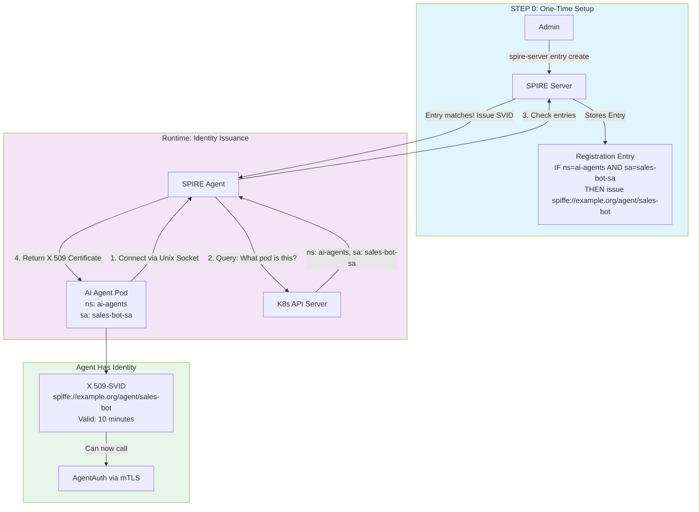
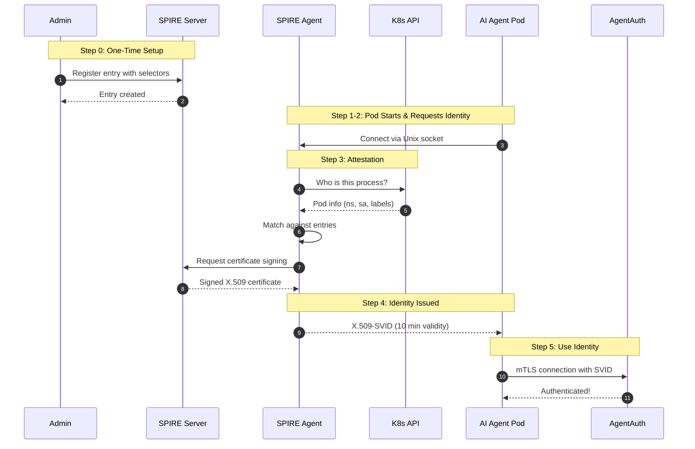
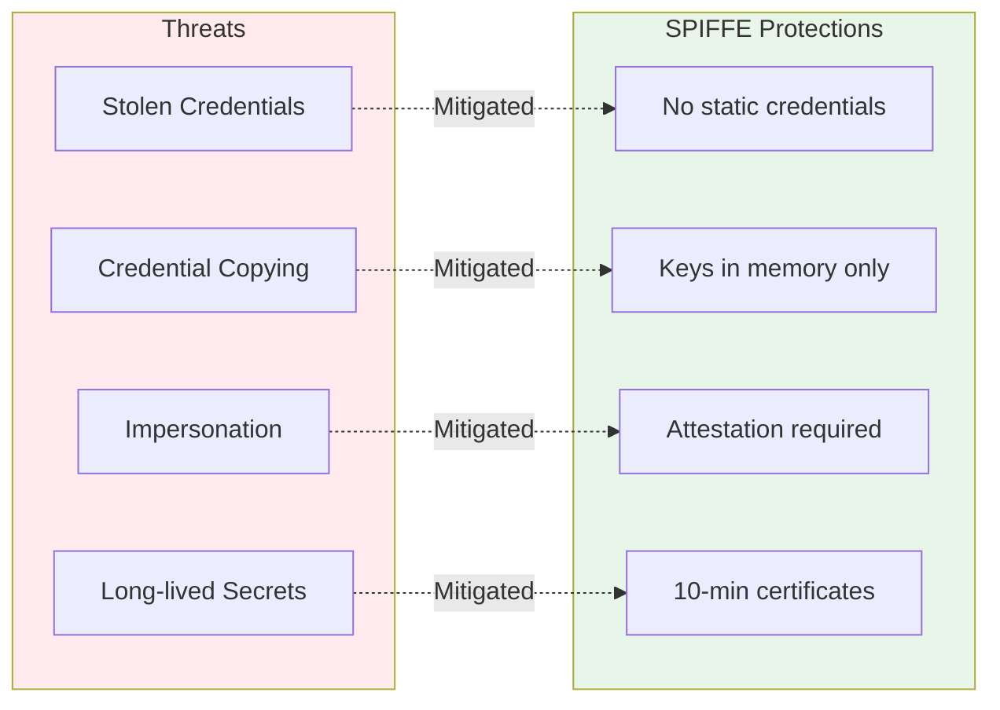
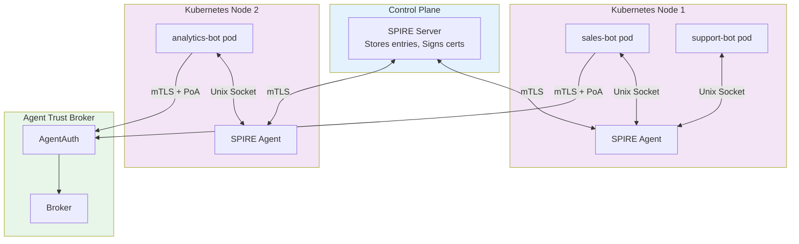

# Agent Identity Flow Diagrams

## How an Agent Gets Its SPIFFE Identity

```mermaid
flowchart TB
    subgraph SETUP ["STEP 0: One-Time Setup"]
        ADMIN["Admin"]
        SPIRE_SERVER["SPIRE Server"]
        ADMIN -->|"spire-server entry create"| SPIRE_SERVER
        SPIRE_SERVER -->|"Stores Entry"| ENTRY["Registration Entry<br/>IF ns=ai-agents AND sa=sales-bot-sa<br/>THEN issue spiffe://example.org/agent/sales-bot"]
    end

    subgraph RUNTIME ["Runtime: Identity Issuance"]
        POD["AI Agent Pod<br/>ns: ai-agents<br/>sa: sales-bot-sa"]
        SPIRE_AGENT["SPIRE Agent"]
        K8S_API["K8s API Server"]

        POD -->|"1. Connect via Unix Socket"| SPIRE_AGENT
        SPIRE_AGENT -->|"2. Query: What pod is this?"| K8S_API
        K8S_API -->|"ns: ai-agents, sa: sales-bot-sa"| SPIRE_AGENT
        SPIRE_AGENT -->|"3. Check entries"| SPIRE_SERVER
        SPIRE_SERVER -->|"Entry matches! Issue SVID"| SPIRE_AGENT
        SPIRE_AGENT -->|"4. Return X.509 Certificate"| POD
    end

    subgraph RESULT ["Agent Has Identity"]
        IDENTITY["X.509-SVID<br/>spiffe://example.org/agent/sales-bot<br/>Valid: 10 minutes"]
        POD --> IDENTITY
        IDENTITY -->|"Can now call"| AGENTAUTH["AgentAuth via mTLS"]
    end

    style SETUP fill:#e1f5fe
    style RUNTIME fill:#f3e5f5
    style RESULT fill:#e8f5e9
```

## Sequence Diagram

```mermaid
sequenceDiagram
    autonumber
    participant Admin
    participant SS as SPIRE Server
    participant SA as SPIRE Agent
    participant K8s as K8s API
    participant Pod as AI Agent Pod
    participant AA as AgentAuth

    Note over Admin,SS: Step 0: One-Time Setup
    Admin->>SS: Register entry with selectors
    SS-->>Admin: Entry created

    Note over Pod,SA: Step 1-2: Pod Starts & Requests Identity
    Pod->>SA: Connect via Unix socket

    Note over SA,K8s: Step 3: Attestation
    SA->>K8s: Who is this process?
    K8s-->>SA: Pod info (ns, sa, labels)
    SA->>SA: Match against entries
    SA->>SS: Request certificate signing
    SS-->>SA: Signed X.509 certificate

    Note over Pod,SA: Step 4: Identity Issued
    SA-->>Pod: X.509-SVID (10 min validity)

    Note over Pod,AA: Step 5: Use Identity
    Pod->>AA: mTLS connection with SVID
    AA-->>Pod: Authenticated!
```

## Security Model

```mermaid
graph LR
    subgraph THREATS ["Threats"]
        T1["Stolen Credentials"]
        T2["Credential Copying"]
        T3["Impersonation"]
        T4["Long-lived Secrets"]
    end

    subgraph PROTECTIONS ["SPIFFE Protections"]
        P1["No static credentials"]
        P2["Keys in memory only"]
        P3["Attestation required"]
        P4["10-min certificates"]
    end

    T1 -.->|"Mitigated"| P1
    T2 -.->|"Mitigated"| P2
    T3 -.->|"Mitigated"| P3
    T4 -.->|"Mitigated"| P4

    style THREATS fill:#ffebee
    style PROTECTIONS fill:#e8f5e9
```

## Component Architecture

```mermaid
graph TB
    subgraph CONTROL["Control Plane"]
        SS["SPIRE Server<br/>Stores entries, Signs certs"]
    end

    subgraph NODE1["Kubernetes Node 1"]
        SA1["SPIRE Agent"]
        POD1["sales-bot pod"]
        POD2["support-bot pod"]
        POD1 <-->|"Unix Socket"| SA1
        POD2 <-->|"Unix Socket"| SA1
    end

    subgraph NODE2["Kubernetes Node 2"]
        SA2["SPIRE Agent"]
        POD3["analytics-bot pod"]
        POD3 <-->|"Unix Socket"| SA2
    end

    SS <-->|"mTLS"| SA1
    SS <-->|"mTLS"| SA2

    subgraph ATB["Agent Trust Broker"]
        AA["AgentAuth"]
        BROKER["Broker"]
    end

    POD1 -->|"mTLS + PoA"| AA
    POD3 -->|"mTLS + PoA"| AA
    AA --> BROKER

    style CONTROL fill:#e3f2fd
    style NODE1 fill:#f3e5f5
    style NODE2 fill:#f3e5f5
    style ATB fill:#e8f5e9
```
