# Ultimate SPIFFE/SPIRE Agent Identity Lifecycle

> **A high-fidelity visualization merging administrative setup, cryptographic attestation, and zero-trust service communication**

## Architecture Overview

This diagram illustrates the complete lifecycle of workload identity in a Kubernetes environment using SPIFFE/SPIRE, from initial policy setup through cryptographic attestation to secure service-to-service communication.

```mermaid
graph TB
    %% --- STYLE DEFINITIONS ---
    classDef control fill:#e3f2fd,stroke:#1565c0,stroke-width:2px,color:#0d47a1
    classDef nodeArch fill:#f3e5f5,stroke:#7b1fa2,stroke-width:2px,color:#4a148c
    classDef workload fill:#e8f5e9,stroke:#2e7d32,stroke-width:2px,color:#1b5e20
    classDef security fill:#fff3e0,stroke:#ef6c00,stroke-width:2px,color:#e65100
    classDef boundary stroke-dasharray: 5 5

    %% --- PHASE 1: TRUST ANCHOR ---
    subgraph CONTROL_PLANE ["🛡️ CONTROL PLANE: Policy & Authority"]
        direction LR
        ADMIN["👤 Admin<br/>(Security Ops)"]
        SS["<b>SPIRE Server</b><br/>Trust Root / CA"]
        ENTRY[("Policy Store<br/>(Selectors)")]

        ADMIN -->|"1. Map Attributes to ID"| SS
        SS <--> ENTRY
    end

    %% --- PHASE 2: LOCAL ATTESTATION ---
    subgraph K8S_NODE ["🏗️ KUBERNETES NODE: The Execution Environment"]
        direction TB
        
        subgraph INFRA ["Node Services"]
            KAPI[["☸️ K8s API Server<br/>(Source of Truth)"]]
            SAGENT["🕵️ <b>SPIRE Agent</b><br/>Local Attestor"]
        end

        subgraph POD ["AI Workload Space"]
            direction TB
            AGENT_POD("🤖 <b>AI Agent Pod</b><br/>ns: ai-agents<br/>sa: sales-bot")
            SOCKET(connector)
            SVID[["📜 <b>X.509 SVID</b><br/>Identity: spiffe://...<br/>TTL: 10 Minutes"]]
        end

        %% Logic Flow within Node
        AGENT_POD -->|"2. Request Identity"| SOCKET
        SOCKET --- SAGENT
        SAGENT <-->|"3. Attest DNA (UID/Labels)"| KAPI
        SAGENT <-->|"4. Request Signing"| SS
        SAGENT -.->|"5. Issue Cert to Memory"| SVID
        SVID ===> AGENT_POD
    end

    %% --- PHASE 3: AUTHENTICATED ACTION ---
    subgraph TARGET ["🔐 SECURE ACCESS: Zero Trust"]
        direction LR
        AA["<b>AgentAuth Proxy</b><br/>mTLS Enforcement"]
        API["Protected API / LLM"]

        AGENT_POD ==>|"6. Authenticated Request<br/>(mTLS + PoA)"| AA
        AA --> API
    end

    %% --- SECURITY MOAT (Annotated Benefits) ---
    subgraph PROTECTIONS ["✨ SECURITY GUARANTEES"]
        P1["<b>Zero Secrets:</b> No passwords in code"]
        P2["<b>Auto-Rotation:</b> Expired in 10 mins"]
        P3["<b>Attested:</b> Verified by K8s kernel"]
        P4["<b>Memory-Only:</b> No keys on disk"]
    end

    %% --- APPLY CLASSES ---
    class CONTROL_PLANE,SS,ENTRY,ADMIN control
    class K8S_NODE,SAGENT,KAPI nodeArch
    class POD,AGENT_POD,SVID workload
    class TARGET,AA,API security
    class PROTECTIONS boundary
```



## Key Features

This visualization provides:

- **Unified view of Setup, Issuance, and Usage** - Complete lifecycle from policy definition to authenticated access
- **Color-coded domains** for clarity:
  - 🔵 **Blue** (Authority) - Control plane and policy management
  - 🟣 **Purple** (Infrastructure) - Kubernetes node and attestation services
  - 🟢 **Green** (Workload) - Application pods and identity credentials
  - 🟠 **Orange** (Outcome) - Secure access and enforcement
- **10-minute short-lived certificate lifecycle** - Explicit TTL highlighting automatic rotation
- **Explicit threat protection mapping** - Direct link between architecture and security outcomes

---

## Phase-by-Phase Breakdown

### Phase 1: Trust Anchor & Policy Setup (Blue Domain)

**Components:**
- **Admin (Security Ops)** - Human operator defining identity policies
- **SPIRE Server** - Acts as the Certificate Authority and trust root
- **Policy Store** - Contains registration entries mapping workload attributes to identities

**Process:**
1. Administrator creates registration entries that map Kubernetes attributes (namespace, service account, labels) to SPIFFE IDs
2. These policies are stored in the SPIRE Server's database
3. The SPIRE Server becomes the authoritative source for "who gets what identity"

**Example Policy:**
```yaml
spiffe://trust-domain/ai-agents/sales-bot
  Selectors:
    - k8s:ns:ai-agents
    - k8s:sa:sales-bot
```

---

### Phase 2: Local Attestation & Identity Issuance (Purple/Green Domains)

**Components:**
- **SPIRE Agent** - DaemonSet running on each Kubernetes node
- **Kubernetes API Server** - Source of truth for pod metadata
- **AI Agent Pod** - The workload requesting an identity
- **Unix Domain Socket** - Secure local communication channel
- **X.509 SVID** - The cryptographic identity certificate

**Process:**
2. **Identity Request**: AI Agent Pod connects to SPIRE Agent via Unix domain socket
3. **Attestation**: SPIRE Agent queries Kubernetes API to verify pod's attributes (UID, namespace, service account, labels)
4. **Certificate Request**: SPIRE Agent requests the SPIRE Server to sign a certificate for this workload
5. **Issuance**: SPIRE Server validates against policy and issues a short-lived X.509 SVID (10-minute TTL)
6. **Delivery**: Certificate is delivered to pod's memory only (never written to disk)

**Key Security Properties:**
- **Cryptographic Attestation**: Identity is proven through Kubernetes kernel verification, not secrets
- **Just-in-Time**: Certificates are created on-demand when workload starts
- **Short-Lived**: 10-minute expiration forces automatic rotation
- **Memory-Only**: No persistent credentials that could be stolen

---

### Phase 3: Authenticated Communication (Orange Domain)

**Components:**
- **AgentAuth Proxy** - mTLS enforcement gateway
- **Protected API/LLM** - Secured backend service

**Process:**
6. **Authenticated Request**: AI Agent Pod presents its X.509 SVID during TLS handshake
7. **Verification**: AgentAuth Proxy validates:
   - Certificate signature (issued by trusted SPIRE Server)
   - Certificate expiration (still within 10-minute window)
   - SPIFFE ID matches authorization policy
8. **Access Granted**: Request is forwarded to protected API

**Proof of Authentication (PoA):**
- mTLS provides both authentication and encryption
- SPIFFE ID in certificate is used for fine-grained authorization
- No bearer tokens or API keys involved

---

## Security Guarantees

### ✨ **Zero Secrets in Code**
No passwords, API keys, or tokens are embedded in container images or environment variables. Identity is derived from platform attestation.

### ✨ **Auto-Rotation Every 10 Minutes**
Certificates expire quickly, forcing automatic renewal. This limits the blast radius if credentials are ever compromised.

### ✨ **Attested by Kubernetes Kernel**
The SPIRE Agent verifies workload identity through the Kubernetes API Server, making it nearly impossible to spoof without cluster access.

### ✨ **Memory-Only Credentials**
Private keys never touch disk storage, reducing exposure to file-based attacks or forensic extraction.

---

## Real-World Application: AI Agent Authentication

In the context of AI agents accessing LLM APIs:

1. **Traditional Approach** ❌
   - API keys stored in Kubernetes secrets
   - Long-lived credentials with broad permissions
   - Risk of key leakage through logs or compromised pods

2. **SPIFFE/SPIRE Approach** ✅
   - Each AI agent pod gets a unique, cryptographically-attested identity
   - AgentAuth proxy verifies identity before allowing LLM access
   - Automatic credential rotation every 10 minutes
   - Granular authorization based on SPIFFE ID (e.g., `sales-bot` can only access customer service models)

---

## Technical Deep Dive

### SVID Structure
```
Subject: spiffe://production-cluster/ai-agents/sales-bot
Issuer: spiffe://production-cluster/spire/server
Validity: 2026-01-15 14:30:00 to 14:40:00 UTC
Subject Alternative Names:
  - URI: spiffe://production-cluster/ai-agents/sales-bot
```

### Attestation Flow
```
1. Pod starts → kernel assigns UID
2. SPIRE Agent queries kubelet → gets pod metadata
3. Metadata matched against registration entries
4. If match found → SVID issued
5. If no match → request denied
```

### Authorization Model
```
Identity (SPIFFE ID) → Policy Evaluation → Access Decision

Example:
  spiffe://.../sales-bot → Can access: customer-service-llm
  spiffe://.../finance-bot → Can access: financial-analysis-llm
```

---

## Deployment Considerations

### Prerequisites
- Kubernetes 1.20+ with CSI driver support
- SPIRE Server deployed with HA configuration
- SPIRE Agent DaemonSet on all nodes
- Unix domain socket volume mounts configured

### Performance Impact
- **Latency**: <10ms for certificate issuance
- **Overhead**: Minimal CPU/memory footprint
- **Scalability**: Tested with 10,000+ workloads per cluster

### Monitoring
Key metrics to track:
- SVID issuance rate
- Attestation failures
- Certificate expiration events
- Policy evaluation time

---

## Comparison to Alternative Approaches

| Approach | Secret Management | Rotation | Attestation | Blast Radius |
|----------|------------------|----------|-------------|--------------|
| **API Keys** | Manual | Manual | None | Entire cluster |
| **K8s Service Accounts** | Automatic | Manual | Weak | Per namespace |
| **SPIFFE/SPIRE** | None needed | Automatic (10m) | Cryptographic | Per workload |

---

## Conclusion

The SPIFFE/SPIRE identity lifecycle transforms workload authentication from a secret management problem into a cryptographic attestation system. By combining Kubernetes platform knowledge with short-lived certificates and zero-trust principles, it provides a robust foundation for securing AI agent communication at scale.

**Next Steps:**
1. Deploy SPIRE Server with persistent storage
2. Configure registration entries for your workload patterns
3. Integrate AgentAuth proxy or similar mTLS enforcement
4. Monitor and tune certificate TTL based on security/performance tradeoffs
